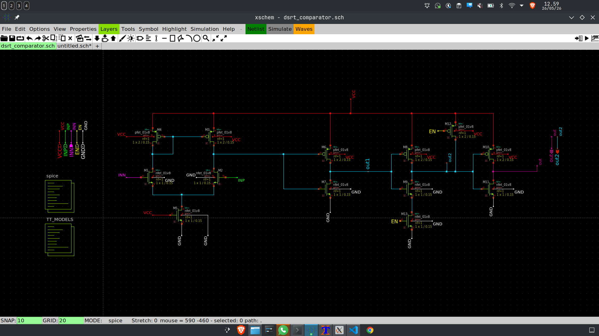
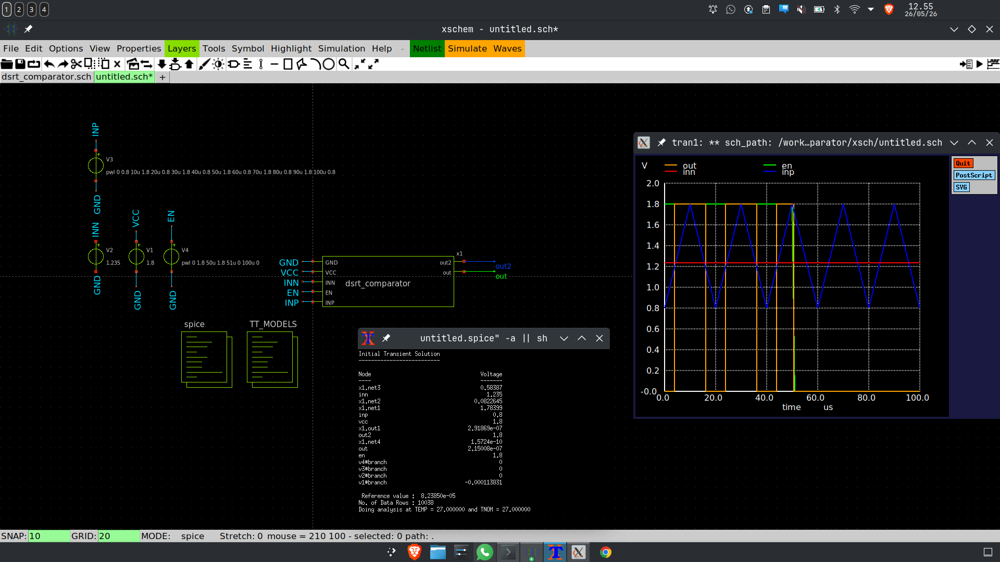
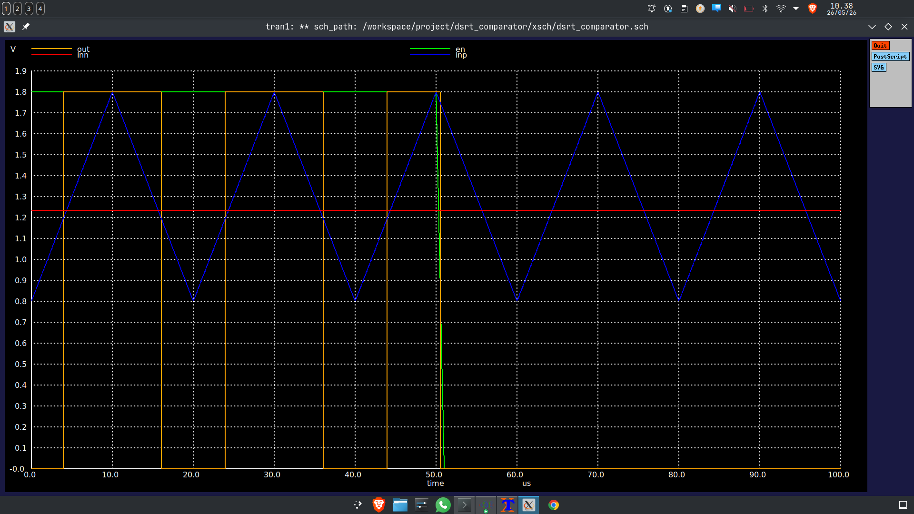
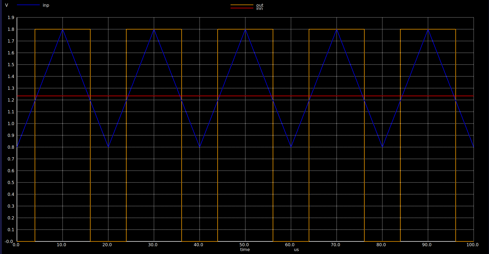
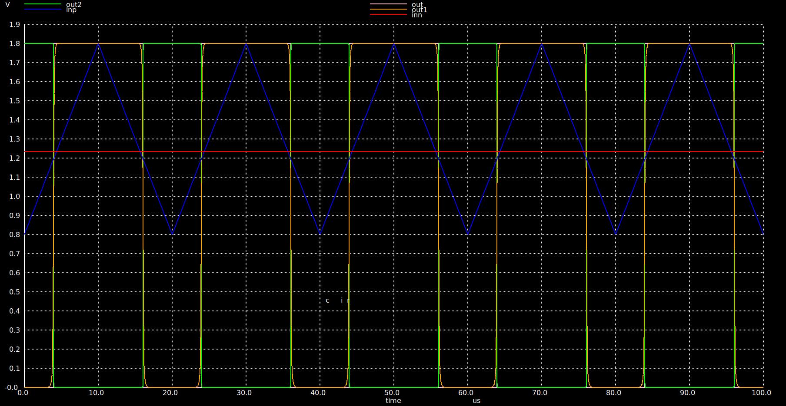
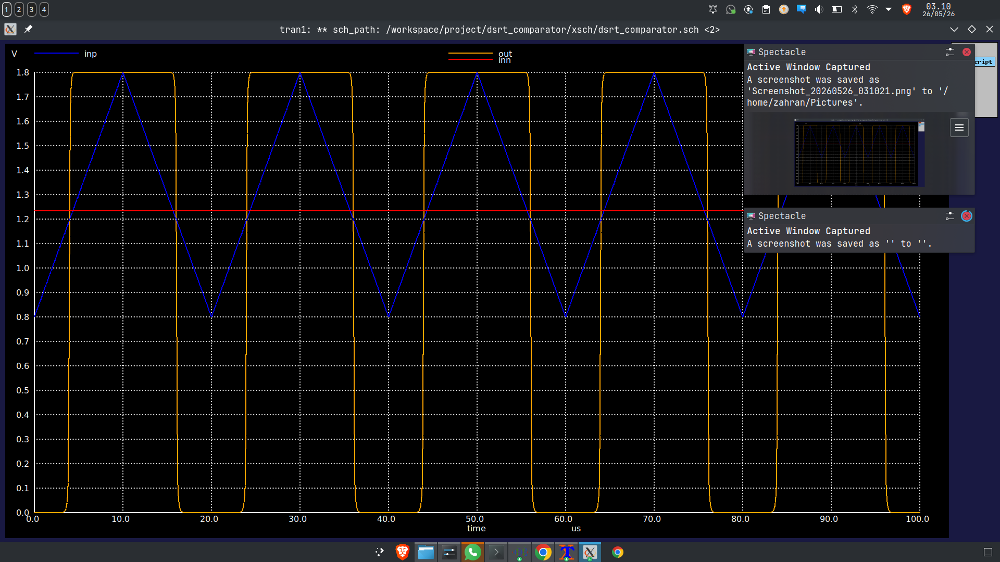
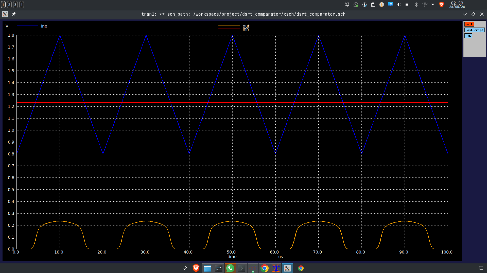
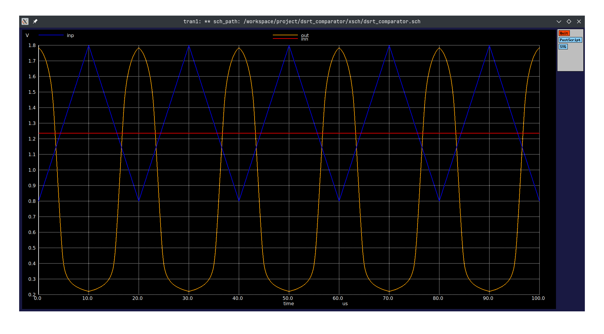

# Comparator Design

This folder contains the schematic and simulation results for the comparator design.

## Full Circuit

*Caption: Full comparator circuit schematic.*

## simulation setup

## Simulation Results

### Output, Input, and Enable Signal

*Caption: Comparator operation when the enable signal is applied together with the input and output waveforms.

### Input and Output Response

*Caption: Comparator output response compared with the input waveform.*

### Combined Output Waveforms

*Caption: Combined waveform view showing multiple comparator outputs together with the input.*

### Output (1st inverter)

*Caption: Output switching behavior with the reference voltage shown as a flat threshold line.*

*

### Comparator Without Inverter Stage (just output off diff pair to gate fet)

*Caption: Comparator behavior for the version without the inverter stage.*

### the output of diff pair

